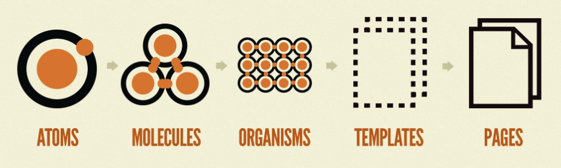
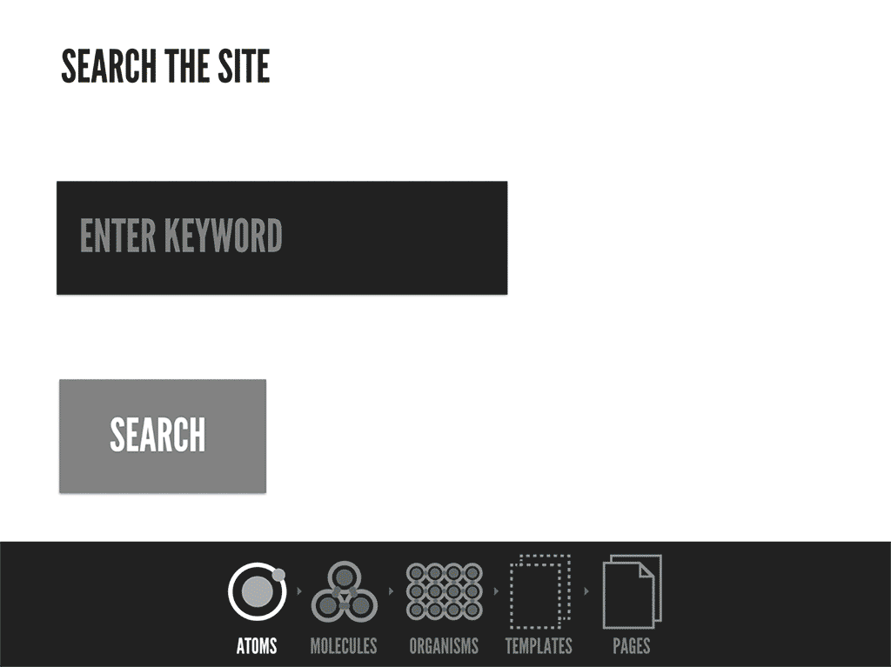

# Atomic Design Thinking

## Introduction

Recently I worked on a Single Page (Web) Application, built in vanilla JavaScript. Without the help of any frameworks that come with tools and methods to structure your code, I had to lay out the project in such a way that it was kept organised, no matter how complex it could become.

A technique, or rather methodology I applied when building this application, was Atomic Design. I'd like to tell you why it's worth considering applying these design principles in your own (future) web app.

## About Atomic Design

Atomic Design is a methodology for creating design systems, it splits up an application in five distinct levels:

1. Atoms
2. Molecules
3. Organisms
4. Templates
5. Pages

<small>_Atomic Design by Brad Frost_</small>

In short, your application is made up of pages that use templates, which are made up of organisms, which in turn utilize molecules, that are made up of atoms.

### Atoms

Atoms are the smallest building blocks of the interface. Atoms are small elements such as a button, an input or a heading, that are meant to be reused further up the tree, more about this below. They generally don't include any of the logic of your application.

### Molecules

Molecules are the next level up from Atoms and can be a little more complex. They are made up of groups of atoms, for example a form molecule that's made up of atoms such as inputs, labels and buttons.

### Organisms

Organisms are groups of molecules joined together to form a distinct section of an interface. For example a header made up of a logo (atom), the navigation (molecule) and a search input field with a button.

### Templates

Templates are not to be confused with pages. A template can be seen as a skeleton of a page, which consists mostly groups of organisms to form pages. Templates are reusable layouts, used by pages. For example, you could have a blog post template that's used by hundreds of pages and a blog overview template used by a single page.

### Pages

Pages are built using a template (skeleton), a page is a specific instance of a template.

On a page, every element can be seen in context and allows you to see how organisms and smaller blocks work together as a whole. It's where variations of specific templates can be tested.

## But why?

Why should you even consider using Atomic Design in the first place? I can't speak for other methodologies or ways to structure your code that might very well work for you (and your team), but here are some pros to Atomic Design:

### Modularity

When it comes to coding, whenever you're writing the same code twice, you're doing unnecessary work. Now, modular development isn't new and when we look at certain frameworks such as React, which is a component based framework, this way of thinking is already somewhat established in most organisations, but Atomic Design and its naming convention implies a hierarchy in your code that pretty much anyone can understand.

Building a component based design system on an atomic levels allows for great reuseability and manageability of elements throughout a project.

Using atoms, molecules and organisms allows for a great deal of different pages and variants to be made, just by mixing and matching components.

**One caveat to be wary of:**

Reuseability throughout a project is great, but also comes with a risk. Changing an atom, the smallest building block, changes it in all molecules and organisms that use that building block as well.

This is great in the sense that you only have to change your code once, but in a large complex application with lots of components, changing something that affects dozens of files can break something if you're not careful.

For example, changing the color of a button won't make a difference anywhere, but if you were to change the size of the button it could affect the way molecules or organisms look.

### Separation between structure and content

Brad Frost said it well: "A well-crafted design system caters to the content that lives inside it, and well-crafted content is aware of how it’s presented in the context of a UI."

Atomic Design makes it easy to look at the content that lives inside the UI structure. There's a clear seperation between the two, although both very much influence each other.

### Understandability

With Atomic Design in mind, you can view your interfaces broken down to their atomic elements and see how each element is combined to form a final experience. It makes it easy to view elements in context and also on their own.

Knowing what atoms, molecules and organisms are and how they are used also makes it easier to explain the codebase to new developers.

### Fast(er) development

Most projects, at least from my own experience, start with the design. Designing, coding and having access to a wide range of atoms before coding actual pages allows developers to mock up pages quickly, just be selecting atoms from the library, shifting things around and trying out different combinations of components. This applies to the design phase of a project as well.

### Building in isolation

A major pro of Atomic Design is the principle of designing, coding and testing components in isolation. Before placing that image slider you coded onto a large page, loading everything, then testing whether it looks good on all screens, do the same, but with just the slider. Testing a component in isolation (first) saves time.

I recommend using the tool **Storybook** to build and test your UI components in isolation: https://storybook.js.org/

## Atomic Design in practice

The Atomic Design Methodology can be applied to any and all user interfaces. Whether that's Microsoft Word, Photoshop or any site you've recently visited or that new project you're going to work on.

Brad Frost demonstrates this, by taking a look at the Instagram app, although the UI is outdated, this applies to the current and future version of the app as well:

<small>Atomic Design applied to the native Instagram app</small>

- **Atoms**, the smallest building blocks: icons, text elements, images such as an avatar and main image.

- **Molecules**: a combination of previously mentioned atoms. For example the bottom navigation bar with multiple icons.

- **Organisms**: where the layout starts to come together

- **Templates**: this is the skeleton layout, to be reused throughout the app.

- **Pages**: the final product, the template with content filled in.

The Atomic Design methodology can be applied to anything that involves a User Interface. This includes web apps using a specific framework such as React, or none at all.

## Resources

https://bradfrost.com/blog/post/atomic-web-design/

https://atomicdesign.bradfrost.com/chapter-2/

https://www.creativebloq.com/web-design/10-reasons-you-should-be-using-atomic-design-61620771

https://tsh.io/blog/atomic-design-explained-by-ryan-reynolds/